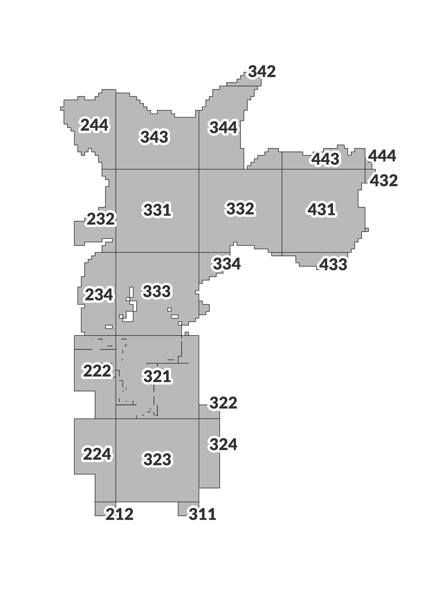

# Ortofotos 2017

Repositório espelho do site GeoSampa contendo as imagens das ortofotos de 2017 da Cidade de São Paulo

## Objetivo

Esse repositório tem por objetivo espelhar os downloads realizados diretamente do site do GeoSampa das ortofotos do voo de 2017 sobre a cidade de São Paulo

## Motivação

O site do GeoSampa é um bem público e possui limite de banda para download afim de, entre outros motivos, democratizar o acesso a informaçao. Muitas vezes necessitamos de imagens de toda a cidade para algum processamento ou levantamento, como diversos aqui nesta pesquisa. No entanto, algumas vezes o processo de download pode ser lento e exigir estratégias de abordagem. Dessa forma, aproveitando os limites disponibilizados pelo GitHub, sua capacidade de banda, e os esforços de download já realizados, aproveito para compartilhar com quem necessite os arquivos por aqui, de forma íntegra do download realizado no site do GeoSampa em 31/01/2022.

## Método

AS URLs foram geradas a partir do arquivo de articulalção de imagens de 2017, classificados pelo SCM (https://github.com/geoinfo-smdu/SCM). De posse das URLs os arquivos foram baixados de forma automatizada utilizando Python com a biblioteca Selenio que controla uma instância do Google Chrome aberta. Esse  processo teve que ser realizado pois os links acionam JavaScript no Browser para permitir o download. Os arquivos levaram cerca de 16 horas para serem baixados e então foram validados com o arquivo de articulação de imagens. Dessa forma, os poucos downloads que falharam puderam ser baixados manualmente para completar o conjunto de arquivos. 

Os arquivos então foram descomprimidos, validados novamente pelo arquivo de articulação de imagens na pasta `RGB-2017`. Como não foi possível commitar todos os arquivos aqui no repositório, os arquivos foram zipados em 20 volumes e disponibilizados em um DataSet do Kaggle disponível em https://www.kaggle.com/andasampa/ortofotos-2017-RGB

O método está disponibilizado no Jupyter Notebook aqui no repositório intitulado `Download de arquivos de imagens.ipynb` e o script de download no arquivo `download-imagens.py`

## Resultados

Os resultados, ou seja, os arquivos de imagens RGB de 2017 baixados do GeoSampa podem então ser acessados pelo DataSet do Kaggle (https://www.kaggle.com/andasampa/ortofotos-2017-RGB). Eles estão organizados pelo SCM (https://github.com/geoinfo-smdu/SCM) com os 3 primeiros dígitos, conforme legenda abaixo. Dessa forma é possível baixar apenas porções específicas da cidade conforme a necessidade.

